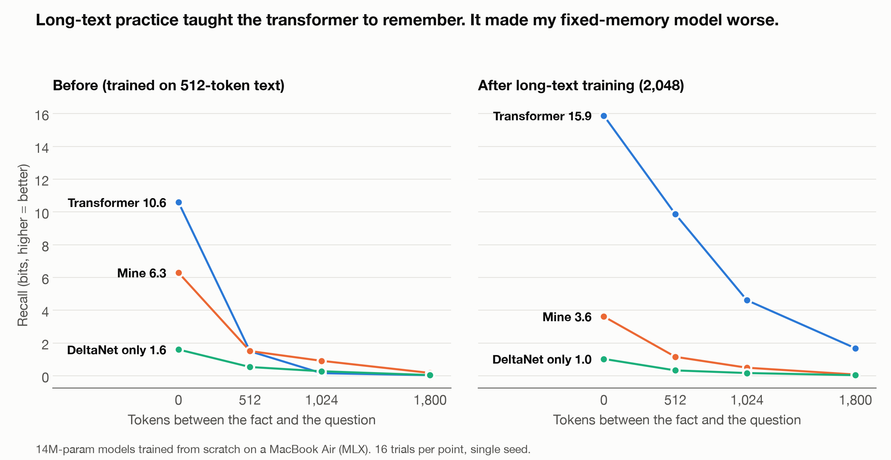

# slm

Small language models with constant memory, trained from scratch on a MacBook Air.

A transformer keeps every token it has read in its KV cache, so it gets heavier and slower the longer it runs. I want a model for long-running agents and robots that doesn't: fixed memory, fixed cost per token, and quality that holds up against a transformer of the same size. Everything here is built in [MLX](https://github.com/ml-explore/mlx) and trained on one 16 GB M4 MacBook Air.

The current model is a hybrid: Gated DeltaNet layers (fixed-size recurrent state) plus a layer of my own called Priority Memory Attention. That layer is a bank of 64 exact key/value slots per head, and it keeps the highest-priority tokens it has seen. The eviction rule can be computed in parallel during training, so the model trains on exactly the memory it streams with.

## Results so far

All models have ~13.8M parameters and saw the same 49M tokens (11 languages plus tool-call data), each at its own best learning rate. Every number comes from a logged run in `results/`. The write-up for each experiment is in [EXPERIMENTS.md](EXPERIMENTS.md).

**Quality** (bits per byte on held-out text, lower is better)

| model | all text | tool-call text | tool calls fully correct |
|---|---|---|---|
| Transformer | 1.642 | 0.840 | 38% |
| Gated DeltaNet only | 1.636 | 0.833 | 37% |
| DeltaNet + Priority Memory | **1.619** | **0.806** | **44%** |

The hybrid wins on all 11 languages. Removing the Priority Memory layers costs 1% bpb and 7 points of exact tool calls, so the layer is doing real work. It only looked useless in short 12M-token tuning runs; over the full run it overtook DeltaNet-only around step 3,500.

**Inference cost** (batch 1, measured on the M4)

| | Transformer | DeltaNet + Priority Memory |
|---|---|---|
| state after 32K tokens | 805 MB (grows forever) | 1.07 MB (constant) |
| peak memory at 32K | 2.5 GB | 176 MB |
| decode speed at 512 / 8K / 32K tokens | 585 / 124 / 30 tok/s | ~326 at every length |
| energy per generated token (powermetrics) | 23.6 mJ | 17.9 mJ (−24%) |
| energy per prompt token | 0.83 mJ | 0.32 mJ (−61%) |

The transformer is faster on short contexts (it still edges ahead at 2K tokens). Somewhere between 2K and 8K the hybrid takes over: 2.6x faster at 8K, 11x at 32K.

**The open problem: recall over long distances**

I continued training all three models on 2,048-token text, with a quarter of it being planted-fact practice (facts early, questions much later). The transformer learned to use its whole window. The fixed-memory models got worse.



My current read is that the slot memory has no training signal for *what it should have kept*. Eviction is a hard top-M cut, so nothing tells it a dropped token was needed later. Fixing that is the next piece of work. Full table: [reports/figures/recall_table.png](reports/figures/recall_table.png).

## Repository layout

| path | what's in it |
|---|---|
| `src/slm/data/` | streaming downloads, tokenizer training, sharding, mixture loader, synthetic recall rows |
| `src/slm/models/` | attention, gated linear attention, Gated DeltaNet (chunked training + exact streaming), Priority Memory Attention, model assembly |
| `src/slm/eval/` | bits per byte, needle-in-a-stream, tool-call accuracy, memory/speed by length, MQAR |
| `src/slm/train.py` | training loop |
| `configs/` | one JSON per architecture |
| `scripts/` | sweeps, evals, energy measurement, figures |
| `results/<run>/` | config, log, loss curve and metrics for every run |
| `reports/` | tokenizer study, figures |
| `docs/` | literature notes, an MLX bug I hit along the way |
| `archive/` | interrupted and superseded runs (kept, never deleted) |

Layer patterns in configs: `A` attention, `W` sliding-window attention, `G` gated linear attention, `D` Gated DeltaNet, `P` Priority Memory Attention, `C` short conv. `"DDDP"` repeats D, D, D, P through the depth.

## Running it

```bash
uv venv --python 3.12 .venv && source .venv/bin/activate
uv pip install -r requirements.txt
export PYTHONPATH=src

# data (capped, streamed): 11 languages + tool calls, then tokenize
python -m slm.data.download
python -m slm.data.tooldata
python -m slm.data.shards mbpe16k

# tests: chunked == recurrent, streaming == full forward, weights never modified
python -m pytest -q tests/

# learning-rate sweep, then a full run at the best LR
python scripts/sweep.py --config configs/DP_gdn_pma.json

# recall, tool calls, memory and speed by length
python scripts/eval_model.py --run DP_gdn_pma_full

# energy (needs sudo for powermetrics)
sudo scripts/energy.sh --runs A_transformer_full,DP_gdn_pma_full
```

A full 49M-token run takes about 1.5–2 hours on the Air and peaks around 8 GB of RAM.

## Caveats

These are 14M-parameter models with one seed per configuration. The quality gaps are around 1%, which is real in these runs but small. Nothing here has been tested at scale yet.
